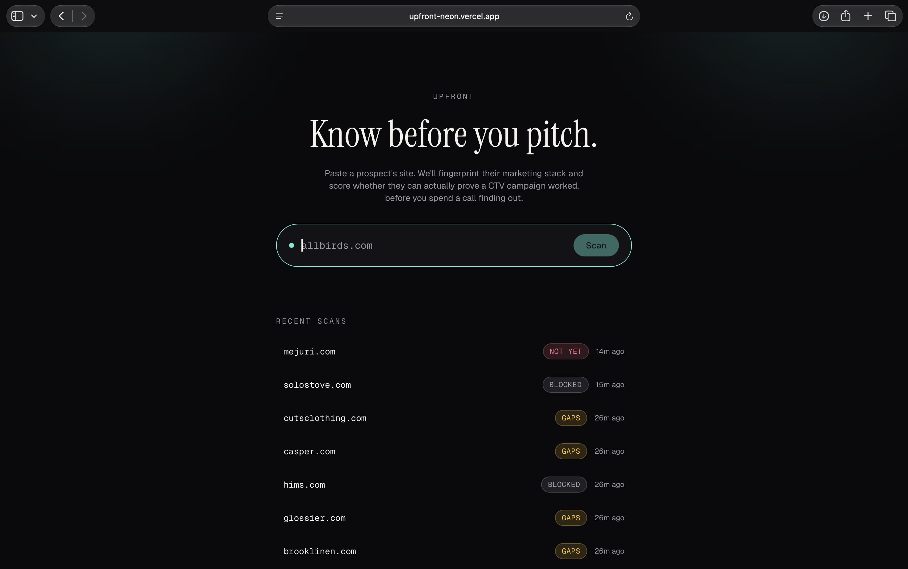

# Upfront

Paste in a brand's website. Find out whether that brand is set up to measure a streaming TV campaign, or whether they'll churn because they can't see results.

**Live:** [upfront-neon.vercel.app](https://upfront-neon.vercel.app) · **Scan a sample:** [upfront-neon.vercel.app/scan/cms2vsqsd0009de75di68z83w](https://upfront-neon.vercel.app/scan/cms2vsqsd0009de75di68z83w)

---

## What it does

1. Fetches the target site's HTML and response headers server-side.
2. Fingerprints its marketing stack, pixels, commerce platform, retention tooling.
3. Scores it across four pillars against a configurable ICP profile.
4. Claude writes a short rationale in plain English.
5. Persists everything so scans can be compared.



## Why this

Vibe sells performance CTV to DTC brands. The expensive failure is a brand that buys, can't attribute the campaign, and leaves. So the qualifying question isn't "would they like TV," it's "can they see whether it worked."

That's a question you can partly answer from the outside, because the answer is sitting in their `<head>`. A brand running Meta Pixel, GA4, Shopify, and Klaviyo has the infrastructure to attribute a CTV campaign. A brand running nothing but a contact form does not.

**Honest framing:** the rubric operationalizes a hypothesis a sales team already holds. It is not a validated churn model.

## Running it

```shell
git clone [repo] && cd upfront
cp .env.example .env      # add DATABASE_URL, DIRECT_URL, ANTHROPIC_API_KEY, OPR_API_KEY
npm install
npx prisma migrate dev
npm run seed               # 6 real DTC brands, so it's never empty
npm run dev
```

Supabase needs two connection strings, pooled (`:6543`) for the app, direct (`:5432`) for migrations. Prisma 7 routes them separately: `prisma.config.ts` uses the direct URL for migrations, and a `PrismaPg` driver adapter in `lib/db.ts` uses the pooled URL at runtime.

## Architecture

```
app/
  page.tsx               scan input, recent scans
  scan/[id]/page.tsx     scorecard, evidence trail, rationale
  api/scan/route.ts      POST handler, a thin wrapper over lib/pipeline
  components/            Badge, PillarBar, ScanForm, ScanStateNotice
lib/
  pipeline.ts            orchestrates scan -> score -> narrative -> persist
  detection/             fingerprints.ts, scan.ts
  scoring/               rubric.ts, bands.ts, rubric.test.ts
  enrichment/            openpagerank.ts
  narrative/             claude.ts
  db.ts                  Prisma client over a pg driver adapter
```

Each layer is independently testable. `lib/scoring` is pure functions, no I/O, no network, no LLM, so the rubric can be unit-tested and reasoned about on its own. `lib/detection` knows nothing about scoring. `lib/pipeline.ts` is the one place that composes fetch, fingerprint, score, narrative, and persistence, and it's the same function both `/api/scan` and the seed script call, so there's exactly one code path that writes a `Scan` row.

**APIs used:** Open PageRank (domain authority, feeds the Scale pillar) and the Anthropic API (rationale text).

## Data model

Four tables: `Scan`, `Detection`, `Score`, `IcpProfile`.

- **`Detection` is one row per finding, not a JSON blob.** "How many scanned brands run Klaviyo" should be a `groupBy`, not a full-table scan and a parse.
- **`Detection.confidence` distinguishes absent from unobservable.** `CONFIRMED` means the fingerprint matched. `OPAQUE` means a tag manager is present but its contents aren't visible server-side. `UNKNOWN` means the fetch was blocked. A boolean would have collapsed three different truths into one lie.
- **`Detection.matchedOn` stores the literal matched string,** and the UI renders it. Every claim carries its evidence.
- **`Score.rubricVersion`** tracks which rubric produced a score. Without a version, an old score silently starts meaning something new when the rubric changes.
- **`IcpProfile.weights` is a JSON column, not a constant.** Retuning the model doesn't require a deploy.

## Scoring

| Pillar | Weight | Signal | Why |
| :---- | :---- | :---- | :---- |
| Measurable | 45 | Pixels, GA4, Google Ads | The churn predictor. Weighted highest, it's literally the thing being sold. |
| Retention | 25 | Klaviyo, Attentive, Gorgias | Can they capture the audience TV drives them to. |
| Commerce | 15 | Shopify, WooCommerce, Stripe | Is there a conversion event worth attributing. |
| Scale | 15 | Open PageRank | A well-instrumented brand can still be too small to be a TV advertiser. |

Within a pillar, only `CONFIRMED` detections earn points, and the marginal value of stacking tools diminishes fast: one confirmed tool earns 60% of the pillar's weight, two earns 85%, three or more earns 100%. The first pixel proves the capability exists; the fifth barely matters.

**The score is deterministic.** Claude receives the detections and the already-computed pillar scores and writes prose. It never produces a number. I didn't want a value in the UI that I couldn't reproduce or unit-test.

## Known limits

- **Static HTML only.** Tags injected client-side via Google Tag Manager can be missed entirely. The UI never claims a brand "doesn't have" a pixel it can't see, it surfaces `OPAQUE` when a tag manager is present but unreadable, and that detection earns no score credit either way. In practice this means well-instrumented brands that route pixels through GTM (which is most of them) cap out below brands that hardcode a pixel directly, an honest but real bias of a static-HTML-only tool.
- **Some sites block server-side fetches.** That's a first-class `BLOCKED` state, not an error.
- **Fingerprints are a hand-written list of 23.** Good coverage of the DTC stack, no coverage of the long tail.

## What I cut and why

- **Auth / multi-user** — no second persona in scope.
- **Background jobs** — scans run inline in a few seconds. A queue is the first thing I'd add, and the schema already supports it (`Scan.status` is a state machine).
- **Headless browser rendering** — would catch client-injected tags, but adds real infra weight. The `confidence` enum makes the gap visible rather than hiding it. Better to be honest about a limit than to half-fix it.
- **ICP editor UI** — weights already live in the database; the form is a day-two feature.

## What I'd build next

1. **Headless rendering for a second pass** — scan static first, escalate to a real browser only when `OPAQUE` detections exist. Keeps the fast path fast.
2. **Scan history and drift** — the schema already stores every scan with a timestamp. "Brand X added Attentive last month" is a buying signal, and it's a query away.
3. **Fingerprint coverage as data** — move the list into the database so it's editable without a deploy, same as the ICP weights.
4. **Bulk scan from a CSV** — the real GTM workflow is 500 domains, not one.

## Where AI helped, and where I overrode it

- **Helped:** scaffolding, Prisma boilerplate, the first pass at fingerprint regexes, UI component structure once the visual direction was set.
- **Overrode, Prisma 7:** the first schema draft used v6's `directUrl`-in-schema pattern, straight out of training data. Prisma 7 rejects that outright. Fixed by reading the actual error and the real docs, not by guessing.
- **Overrode, Open PageRank:** the API moved entirely under Keywords Everywhere, new host, new auth (`Authorization: Bearer` instead of a custom header), new request and response shape. No amount of pattern-matching would have found that; had to pull the current docs from the KE dashboard.
- **Overrode, visual design:** the first pass leaned toward flashy, Aceternity-style landing page components. Replaced with restrained, hand-rolled CSS (a two-beam spotlight, not a copied component) once it was clear that look reads as templated, the exact thing this brief grades against.
- **Overrode, the narrative prompt:** Claude's first attempt at the scan rationale ignored "no markdown," wrote three paragraphs with a heading, and used an em dash. Caught by actually reading the output against the spec, not by assuming the prompt worked.
- **Caught late, not AI-related:** a Next.js 16 caching default silently prerendered the homepage's "recent scans" list at build time, so it would have frozen on first deploy. Only surfaced by running a real production build; `next dev` always renders fresh and hid it.
- **Refused:** letting the model produce the score. It writes the explanation; the rubric produces the number.
